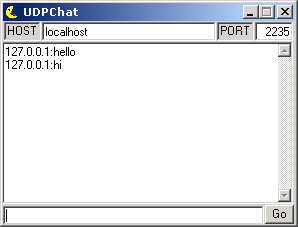



## \[UDP\] Chat

### Description

Send messages over a network with the UDP protocol.
 
### More Info
 

             |
---                |---
**Submitted On**   |2003-01-07 16:20:04
**By**             |[MMeijer](https://github.com/Planet-Source-Code/PSCIndex/blob/master/ByAuthor/mmeijer.md)
**Level**          |Beginner
**User Rating**    |4.7 (80 globes from 17 users)
**Compatibility**  |VB 6\.0
**Category**       |[Complete Applications](https://github.com/Planet-Source-Code/PSCIndex/blob/master/ByCategory/complete-applications__1-27.md)
**World**          |[Visual Basic](https://github.com/Planet-Source-Code/PSCIndex/blob/master/ByWorld/visual-basic.md)
**Archive File**   |[\[UDP\]\_Chat152553172003\.zip](https://github.com/Planet-Source-Code/mmeijer-udp-chat__1-42247/archive/master.zip)

